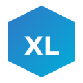

  
  <h1>Xylolabs Inc.</h1>
  
<strong>Industrial intelligence through real-time monitoring, edge computing, and AI-driven analytics.</strong>

  
We build systems that collect, process, and act on data from industrial environments — power plants, container terminals, maritime vessels, and factories.

   
  
  &nbsp;
  
  &nbsp;
  
  &nbsp;
  
    
  
  
  
  
  
  
    
  

---

### Core Products

| Product | Description | Stack |
|---------|-------------|-------|
| **Industrial IoT Platform** | High-resolution audio & sensor streaming from edge devices via LTE-M1 | Rust, React, PostgreSQL |
| **Knowledge Engine** | Unified knowledge base ingesting Slack, Google Workspace, Notion with AI search | Go, SQLite FTS5, Gemini |
| **Factory Operations Dashboard** | Real-time 3D monitoring, predictive maintenance, multi-tenant factory views | Next.js, React Three Fiber, Django |

### Repositories

<!-- REPOS_START -->
<!-- REPOS_END -->

### Organization Stats

<!-- STATS_START -->

| Metric | Value |
|--------|-------|
| **Repositories** | 19 (2 public, 17 private) |
| **Estimated LOC** | 1.0M |
| **Total Commits** | 1.3K |
| **Commits (30d)** | 0 |
| **Contributors** | 2 |

#### Languages

#### Contributor Insights

Last updated: 2026-04-01
<!-- STATS_END -->

---

  <a href="https://xylolabs.com">xylolabs.com</a>

