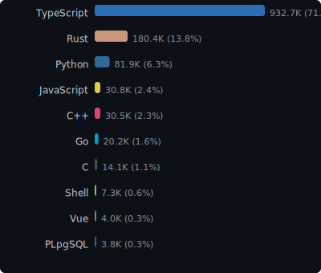
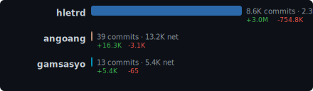

## Xylolabs Inc.

Industrial intelligence through real-time monitoring, edge computing, and AI-driven analytics.

We build systems that collect, process, and act on data from industrial environments — power plants, container terminals, maritime vessels, and factories. Our stack spans embedded firmware to cloud dashboards, enabling predictive maintenance, operational visibility, and intelligent automation at scale.

### Core Products

| Product | Description | Stack |
|---------|-------------|-------|
| **Industrial IoT Platform** | High-resolution audio & sensor streaming from edge devices via LTE-M1 | Rust, React, PostgreSQL |
| **Knowledge Engine** | Unified knowledge base ingesting Slack, Google Workspace, Notion with AI search | Go, SQLite FTS5, Gemini |
| **Factory Operations Dashboard** | Real-time 3D monitoring, predictive maintenance, multi-tenant factory views | Next.js, React Three Fiber, Django |

### Organization Stats

<!-- STATS_START -->

| Metric | Value |
|--------|-------|
| **Repositories** | 12 (2 public, 10 private) |
| **Estimated LOC** | 181.2K |
| **Total Commits** | 1.5K |
| **Commits (30d)** | 0 |
| **Contributors** | 3 |

#### Languages

#### Contributor Insights

Last updated: 2026-03-29
<!-- STATS_END -->

---

[xylolabs.com](https://xylolabs.com)
